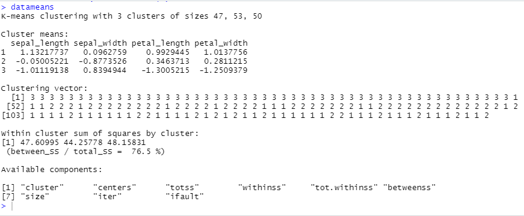
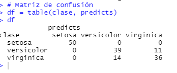
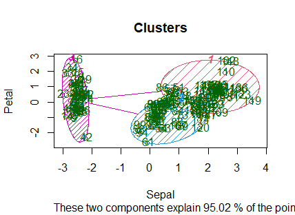

# Exam Unit 4

```R
#added the necessary libraries
library (stats) #contains the method to implement kmeans "
library (cluster) # contains everything to evaluate clusters "
library (ggplot2) #contains the necessary tools for graphing and interpreting data

#We indicate the path of the folder where the file to be used is located
setwd ("C: / Users / deyanira / Downloads / DataMining-master / MachineLearning / K-means")
getwd ()

# We import the data from the specified file type csv
dataset = read.csv ('iris.csv')

# Delete the species column and scale the data since we only need numerical values
dataset.scale <- scale (dataset [, -5])

#The previous count of each type of species is carried out
dataset $ species

# Application of K MEANS this receives two parameters: data and number of clusters to form.
datameans = kmeans (dataset.scale, 3)
datameans
```


```R
# Get group to which the data belongs is obtained according to the kmeans function.
datameans $ cluster
table (datameans $ cluster, dataset $ species)
```


```R
# We assign the class variable, the numerical data as a factor of the data set.
class = factor (dataset [, 5]) ## classifies and stores data in levels

# We assign to the variable predicts, the classes predicted by kmeans.
predicts = NULL

# The function mode will count the number of records of each class
mode = function (x) {
  ux = unique (x)
  ux [which.max (tabulate (match (x, ux)))]
}

# We segment the clustering, We apply the mode function which will return the highest number of occurrences linked to the assigned class.
predicts [datameans $ cluster == mode (datameans $ cluster [1:50])] = "setosa"
predicts [datameans $ cluster == mode (datameans $ cluster [50: 100])] = "versicolor"
predicts [datameans $ cluster == mode (datameans $ cluster [100: 150])] = "virginica"

# The variable is transformed  predicts to factor.
predicts = factor (predicts)
predicts

# Confusion matrix
df = table (class, predicts)
df
precision = (sum (diag (df))) / sum (df)
precision
```



```R
## we graph
clusplot (dataset, datameans $ cluster,
          shade = TRUE, color = TRUE, plotchar = FALSE, span = TRUE,
          labels = 2, main = paste ('Clusters'), xlab = 'Sepal', ylab = 'Petal')
```
 
         
```R
datameans $ size
datameans $ totss
datameans $ withinss
datameans $ iter
datameans $ tot.withinss
datameans $ betweenss
```
