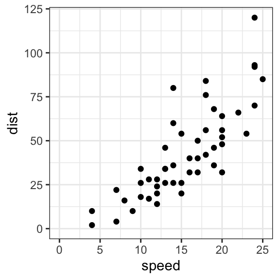

# Data-Mining

## Index
- [Practice 1](#Practice_1)
- [Practice 2](#Practice_2)
- [Practice 3](#Practice_3)
- [Practice 4](#Practice_4)
- [Practice 5](#Practice_5)
- [Practice 5](#Practice_5)
- [Practice 6](#Practice_6)
- [HomeWork 1](#HomeWork_1)
- [HomeWork 2](#HomeWork_2)
- [HomeWork 3](#HomeWork_3)
- [HomeWork 4](#HomeWork_4)
- [HomeWork 5](#HomeWork_5)


## Practice_1

Use a data set with real data and implement it in the practice of simple linear regression.

``` R
getwd()
setwd("C:/Users/Dell/Desktop/Semestre_X/Practica_1")
getwd()

# Importing the dataset
dataset <- read.csv('Salary_Data_Practice.csv')

# Splitting the dataset into the Training set and Test set
# Install.packages('caTools')
library(caTools)
set.seed(123)
split <- sample.split(dataset$Salary, SplitRatio = 2/3)
training_set <- subset(dataset, split == TRUE)
test_set <- subset(dataset, split == FALSE)

# Fitting Simple Linear Regression to the Training set
regressor = lm(formula = Salary ~ YearsExperience,
               data = dataset)
summary(regressor)

# Predicting the Test set results
y_pred = predict(regressor, newdata = test_set)

# Visualising the Training set results
library(ggplot2)
ggplot() +
  geom_point(aes(x=training_set$YearsExperience, y=training_set$Salary),
             color = 'red') +
  geom_line(aes(x = training_set$YearsExperience, y = predict(regressor, newdata = training_set)),
            color = 'blue') +
  ggtitle('Salary vs Experience (Training Set)') +
  xlab('Years of experience') +
  ylab('Salary')

# Visualising the Test set results
ggplot() +
  geom_point(aes(x=test_set$YearsExperience, y=test_set$Salary),
             color = 'red') +
  geom_line(aes(x = training_set$YearsExperience, y = predict(regressor, newdata = training_set)),
            color = 'blue') +
  ggtitle('Salary vs Experience (Test Set)') +
  xlab('Years of experience') +
  ylab('Salary')
```

## Practice_2
Generate the analysis with data visualization using the multiple linear regression code

```R
getwd()
setwd("C:/Users/Dell/Desktop/Semestre_X/Practica_2")
getwd()

# Importing the dataset
dataset <- read.csv('50_Startups.csv')

# Encoding categorical data 
dataset$State = factor(dataset$State,
                       levels = c('New York', 'California', 'Florida'),
                       labels = c(1,2,3))

dataset
# Splitting the dataset into the Training set and Test set
# Install.packages('caTools')
library(caTools)
set.seed(123)
split <- sample.split(dataset$Profit, SplitRatio = 0.8)
training_set <- subset(dataset, split == TRUE)
test_set <- subset(dataset, split == FALSE)

# Fitting Multiple Linear Regression to the Training set
#regressor = lm(formula = Profit ~ R.D.Spend + Administration + Marketing.Spend + State)
regressor = lm(formula = Profit ~ .,
               data = training_set )

summary(regressor)

# Prediction the Test set results
y_pred = predict(regressor, newdata = test_set)
y_pred


# Assigment: visualize the siple liner regression model with R.D.Spend

regressor = lm(formula = Profit ~ R.D.Spend,
               data = training_set )

summary(regressor)

y_pred = predict(regressor, newdata = test_set)
y_pred

# Visualising the Training set results
library(ggplot2)
ggplot() +
  geom_point(aes(x=training_set$R.D.Spend, y=training_set$Profit),
             color = 'red') +
  geom_line(aes(x = training_set$R.D.Spend, y = predict(regressor, newdata = training_set)),
            color = 'blue') 


# Visualising the Test set results
ggplot() +
  geom_point(aes(x=test_set$R.D.Spend, y=test_set$Profit),
             color = 'red') +
  geom_line(aes(x = training_set$R.D.Spend, y = predict(regressor, newdata = training_set)),
            color = 'blue')
```

## Practice_3 

Explain step by step what is the function "Backward Elimination"

```R
getwd()
setwd("C:/Users/Dell/Desktop/Semestre_X/Practice_3")
getwd()

# Importing the dataset
dataset <- read.csv('50_Startups.csv')

# Encoding categorical data 
dataset$State = factor(dataset$State,
                       levels = c('New York', 'California', 'Florida'),
                       labels = c(1,2,3))

dataset
# Splitting the dataset into the Training set and Test set
# Install.packages('caTools')
library(caTools)
set.seed(123)
split <- sample.split(dataset$Profit, SplitRatio = 0.8)
training_set <- subset(dataset, split == TRUE)
test_set <- subset(dataset, split == FALSE)

# Fitting Multiple Linear Regression to the Training set
#regressor = lm(formula = Profit ~ R.D.Spend + Administration + Marketing.Spend + State)
regressor = lm(formula = Profit ~ .,
               data = training_set )

summary(regressor)

# Prediction the Test set results
y_pred = predict(regressor, newdata = test_set)
y_pred


# Homework analise the follow atomation backwardElimination function 
# Resive el dataset y el valor SL
backwardElimination <- function(x, sl) {
  # Determina la longitud del dataset
  numVars = length(x)
  # hace el recorrido por el dataset
  for (i in c(1:numVars)){
    # Ajuste de la regresión lineal multiple por eso tiene un . para que recorra todas las columnas
    regressor = lm(formula = Profit ~ ., data = x)
    # Determina el maximo coeficiente de del modelo modelo 
    maxVar = max(coef(summary(regressor))[c(2:numVars), "Pr(>|t|)"])
    if (maxVar > sl){ # si es mayor con which devolverá la posición de los elementos cuando  "Pr(>|t|)"] == maxVar
      j = which(coef(summary(regressor))[c(2:numVars), "Pr(>|t|)"] == maxVar)
      x = x[, -j] # reasignara la data que debe ser analizada
    }
    numVars = numVars - 1 # siguiente valor
  }
  return(summary(regressor))# al terminar retorna la regresión que satisface lo indicado
}

SL = 0.5
#dataset = dataset[, c(1,2,3,4,5)]
training_set
backwardElimination(training_set, SL)
```

## Practice_4

```R
library(ElemStatLearn)
library(caTools)
library(ggplot2)

getwd()
setwd("/Users/Dell/Desktop/DataMining-master/MachineLearning/LogisticRegression")
getwd()

# Se importa el conjunto de datos con el que trabajará.

dataset <- read.csv('Social_Network_Ads.csv')

# Se seleccionan los columnas con los que trabajaremos.
dataset <- dataset[, 3:5]

set.seed(123)
split <- sample.split(dataset$Purchased, SplitRatio = 0.75)
training_set <- subset(dataset, split == TRUE)
test_set <- subset(dataset, split == FALSE)

training_set[, 1:2] <- scale(training_set[, 1:2])
test_set[, 1:2] <- scale(test_set[, 1:2])

classifier = glm(formula = Purchased ~ .,
                 family = binomial,
                 data = training_set)

# Predecir los resultados del conjunto de prueba
prob_pred = predict(classifier, type = 'response', newdata = test_set[-3])
prob_pred
y_pred = ifelse(prob_pred > 0.5, 1, 0)
y_pred

# se crea la Matriz de Confusión 
cm = table(test_set[, 3], y_pred)
cm

#se asignan los valores a utulizar en elgrafico
ggplot(training_set, aes(x=EstimatedSalary, y=Purchased)) + geom_point() + 
  stat_smooth(method="glm", method.args=list(family="binomial"), se=FALSE)

ggplot(training_set, aes(x=Age, y=Purchased)) + geom_point() + 
  stat_smooth(method="glm", method.args=list(family="binomial"), se=FALSE)

ggplot(test_set, aes(x=EstimatedSalary, y=Purchased)) + geom_point() + 
  stat_smooth(method="glm", method.args=list(family="binomial"), se=FALSE)

ggplot(test_set, aes(x=Age, y=Purchased)) + geom_point() + 
  stat_smooth(method="glm", method.args=list(family="binomial"), se=FALSE)


install.packages(path_to_source, repos = NULL, type="source")
install.packages("~/Downloads/ElemStatLearn_2015.6.26.2.tar", repos=NULL, type="source")

set = training_set
X1 = seq(min(set[, 1]) - 1, max(set[, 1]) + 1, by = 0.01)
X2 = seq(min(set[, 2]) - 1, max(set[, 2]) + 1, by = 0.01)
grid_set = expand.grid(X1, X2)
colnames(grid_set) = c('Age', 'EstimatedSalary')
prob_set = predict(classifier, type = 'response', newdata = grid_set)
y_grid = ifelse(prob_set > 0.5, 1, 0)
plot(set[, -3],
     main = 'Logistic Regression (Training set)',
     xlab = 'Age', ylab = 'Estimated Salary',
     xlim = range(X1), ylim = range(X2))
contour(X1, X2, matrix(as.numeric(y_grid), length(X1), length(X2)), add = TRUE)
points(grid_set, pch = '.', col = ifelse(y_grid == 1, 'springgreen3', 'tomato'))
points(set, pch = 21, bg = ifelse(set[, 3] == 1, 'green4', 'red3'))

#observar el resultado de los datos de prueba
library(ElemStatLearn)
set = test_set
X1 = seq(min(set[, 1]) - 1, max(set[, 1]) + 1, by = 0.01)
X2 = seq(min(set[, 2]) - 1, max(set[, 2]) + 1, by = 0.01)
grid_set = expand.grid(X1, X2)
colnames(grid_set) = c('Age', 'EstimatedSalary')
prob_set = predict(classifier, type = 'response', newdata = grid_set)
y_grid = ifelse(prob_set > 0.5, 1, 0)
plot(set[, -3],
     main = 'Logistic Regression (Test set)',
     xlab = 'Age', ylab = 'Estimated Salary',
     xlim = range(X1), ylim = range(X2))
contour(X1, X2, matrix(as.numeric(y_grid), length(X1), length(X2)), add = TRUE)
points(grid_set, pch = '.', col = ifelse(y_grid == 1, 'springgreen3', 'tomato'))
points(set, pch = 21, bg = ifelse(set[, 3] == 1, 'green4', 'red3'))
```

## Practice_5

```R
getwd()
setwd("Users/deyanira/Downloads/DataMining-master/MachineLearning/LogisticRegression")
getwd()

dataset <- read.csv('Social_Network_Ads.csv')

dataset <- dataset[, 3:5]

library(caTools)
set.seed(123)
split <- sample.split(dataset$Purchased, SplitRatio = 0.75)
training_set <- subset(dataset, split == TRUE)
test_set <- subset(dataset, split == FALSE)

training_set[, 1:2] <- scale(training_set[, 1:2])
test_set[, 1:2] <- scale(test_set[, 1:2])

classifier = glm(formula = Purchased ~ .,
                 family = binomial,
                 data = training_set)

prob_pred = predict(classifier, type = 'response', newdata = test_set[-3])
prob_pred
y_pred = ifelse(prob_pred > 0.5, 1, 0)
y_pred

cm = table(test_set[, 3], y_pred)
cm

library(ggplot2)

ggplot(training_set, aes(x=EstimatedSalary, y=Purchased)) + geom_point() + 
  stat_smooth(method="glm", method.args=list(family="binomial"), se=FALSE)

ggplot(training_set, aes(x=Age, y=Purchased)) + geom_point() + 
  stat_smooth(method="glm", method.args=list(family="binomial"), se=FALSE)

ggplot(test_set, aes(x=EstimatedSalary, y=Purchased)) + geom_point() + 
  stat_smooth(method="glm", method.args=list(family="binomial"), se=FALSE)

ggplot(test_set, aes(x=Age, y=Purchased)) + geom_point() + 
  stat_smooth(method="glm", method.args=list(family="binomial"), se=FALSE)

install.packages(path_to_source, repos = NULL, type="source")
install.packages("~/Downloads/ElemStatLearn_2015.6.26.2.tar", repos=NULL, type="source")

library(ElemStatLearn)
set = training_set
X1 = seq(min(set[, 1]) - 1, max(set[, 1]) + 1, by = 0.01)
X2 = seq(min(set[, 2]) - 1, max(set[, 2]) + 1, by = 0.01)
grid_set = expand.grid(X1, X2)
colnames(grid_set) = c('Age', 'EstimatedSalary')
prob_set = predict(classifier, type = 'response', newdata = grid_set)
y_grid = ifelse(prob_set > 0.5, 1, 0)
plot(set[, -3],
     main = 'Logistic Regression (Training set)',
     xlab = 'Age', ylab = 'Estimated Salary',
     xlim = range(X1), ylim = range(X2))
contour(X1, X2, matrix(as.numeric(y_grid), length(X1), length(X2)), add = TRUE)
points(grid_set, pch = '.', col = ifelse(y_grid == 1, 'springgreen3', 'tomato'))
points(set, pch = 21, bg = ifelse(set[, 3] == 1, 'green4', 'red3'))

library(ElemStatLearn)
set = test_set
X1 = seq(min(set[, 1]) - 1, max(set[, 1]) + 1, by = 0.01)
X2 = seq(min(set[, 2]) - 1, max(set[, 2]) + 1, by = 0.01)
grid_set = expand.grid(X1, X2)
colnames(grid_set) = c('Age', 'EstimatedSalary')
prob_set = predict(classifier, type = 'response', newdata = grid_set)
y_grid = ifelse(prob_set > 0.5, 1, 0)
plot(set[, -3],
     main = 'Logistic Regression (Test set)',
     xlab = 'Age', ylab = 'Estimated Salary',
     xlim = range(X1), ylim = range(X2))
contour(X1, X2, matrix(as.numeric(y_grid), length(X1), length(X2)), add = TRUE)
points(grid_set, pch = '.', col = ifelse(y_grid == 1, 'springgreen3', 'tomato'))
points(set, pch = 21, bg = ifelse(set[, 3] == 1, 'green4', 'red3'))
```

## Practice_6 

```R
getwd()
setwd("/Users/deyanira/Downloads/DataMining-master/MachineLearning/SVM") #se carga el directorio o carpeta donde se encuentran los archivos que utilizaremos
getwd()

dataset = read.csv('datos.csv') #se cargan los datos del archivo que estamos llamando
dataset = dataset[3:4]

dataset$cl = factor(dataset$cl, levels = c(0, 1))

library(caTools) #se utilizara la libreria catools 
set.seed(123) #para crear simulaciones u objetos aleatorios que se pueden reproducir.
split = sample.split(dataset$cl, SplitRatio = 0.75)
training_set = subset(dataset, split == TRUE)
test_set = subset(dataset, split == FALSE)

training_set[-2] = scale(training_set[-2])
test_set[-2] = scale(test_set[-2])

library(e1071)
classifier = svm(formula = cl ~ .,
                 data = training_set,
                 type = 'C-classification',
                 kernel = 'sigmoid')

y_pred = predict(classifier, newdata = test_set[-2])
y_pred

cm = table(test_set[, 2], y_pred)
cm

library(ElemStatLearn)
set = training_set
X1 = seq(min(set[, 1]) - 1, max(set[, 1]) + 1, by = 0.01)
X2 = seq(min(set[, 1]) - 1, max(set[, 1]) + 1, by = 0.01)
grid_set = expand.grid(X1, X2)
colnames(grid_set) = c('x', 'y')
y_grid = predict(classifier, newdata = grid_set)
plot(set[, -3],
     main = 'SVM (Training set)',
     xlab = 'x', ylab = 'y',
     xlim = range(X1), ylim = range(X2))
contour(X1, X2, matrix(as.numeric(y_grid), length(X1), length(X2)), add = TRUE)
points(grid_set, pch = '.', col = ifelse(y_grid == 1, 'springgreen3', 'tomato'))
points(set, pch = 21, bg = ifelse(set[, 2] == 1, 'green4', 'red3'))

library(ElemStatLearn)
set = test_set
X1 = seq(min(set[, 1]) - 1, max(set[, 1]) + 1, by = 0.01)
X2 = seq(min(set[, 1]) - 1, max(set[, 1]) + 1, by = 0.01)
grid_set = expand.grid(X1, X2)
colnames(grid_set) = c('x', 'y')
y_grid = predict(classifier, newdata = grid_set)
plot(set[, -3], main = 'SVM (Test set)',
     xlab = 'x', ylab = 'y',
     xlim = range(X1), ylim = range(X2))
contour(X1, X2, matrix(as.numeric(y_grid), length(X1), length(X2)), add = TRUE)
points(grid_set, pch = '.', col = ifelse(y_grid == 1, 'springgreen3', 'tomato'))
points(set, pch = 21, bg = ifelse(set[, 2] == 1, 'green4', 'red3'))
```

## Homework_1

Geometric and graph grammar


The ggplot2 package is based on graph grammar (Wilkinson, 2005) and this has several advantages over other graphs as a very good aesthetic or simplification in complex graphics commands. Although it also has some limitations since you cannot make three-dimensional or interactive graphics.

The basic idea: independently specify building blocks and combine them to create virtually any type of graphic display you want.

The building blocks of a graph include:
Data.
Aesthetics (Aesthetic mapping).
Geometries.
Facets.
Statistics
Coordinates.
Theme.


Data.
The data we want to visualize and a set of aesthetic elements that describe how the data 
variables will be mapped to aesthetic attributes that we can perceive.
Data that is commonly handled when working with R. 

Data in text (or tabular) format
CSV: .csv (comma separated values ​​or, in Spanish, data separated by commas)
other data in text format
Formats of other programs (proprietary software)
EXCEL: .xls and .xlsx
SPSS: sav and .for
STATA: .dta
SAS: .sas
own formats R
R objects: .RData or .rda
RSerialized objects: .rds
Other Formats
JSON
XML

```R
movies <- read.csv ("Project-Data.csv")
```
Aesthetics (aes).
The main feature of the ggplot2 structure is the way graphics are plotted by adding “layers”. Let's see the process step by step.

The first thing you should do is tell the ggplot function which dataset (or dataset)
to use. This is done by writing ggplot (df), where df is a dataframe that contains all the necessary features to make the plot. Unlike base graphics, ggplot does not take vectors as arguments. This is the first step.

The aes () argument is synonymous with aesthetics, ggplot2 considers the graph's X and Y axis to be aesthetic, along with color, size, shape, fill, etc. Any aesthetic you want can be added within the aes () argument, such as indicating the X and Y axes, specifying the respective variables of the data set. The variable based on which the color, size, shape and stroke should change can also be specified right here. Please note that the aesthetics specified here will be inherited by all subsequent added geom layers unless otherwise noted on each layer.

```R
gg <- ggplot (movies, aes (x = Genre, y = GrossPor))
```
Geometries (geom).
The ggplot2 layers are also called geom. Once the base configuration is done, you can add the geoms on top of each other.
Every graphic has at least one geometry. Geometry determines the type of graph:
- geom_point (for points)
- geom_lines (for lines)
- geom_histogram (for histogram)
- geom_boxplot (for boxplot)
- geom_bar (for bars)
- geom_smooth (smooth lines)
- geom_polygons (for polygons on a map)
- etc. (if you run the command help.search (“geom_”, package = “ggplot2”) you can see the list of geometric objects)

```R
gg + geom_jitter (aes (color = Studio, size = Budget))
```

```R
gg + geom_jitter (aes (color = Studio, size = Budget)) + geom_boxplot (aes (color = Budget, alpha =1.5))
```
Facets.
When you call ggplot it provides a data source, usually a data frame, then asks ggplot to assign different variables in our data source to a different aesthetic, such as the position of the x or y axes the color of our points or bars. With facets, you get an additional way to map variables. To demonstrate this, you will use the following data set, which includes a series of economic indicators for a selection of countries. Most of these are variants of the GDP, the Gross Domestic Product of each country.


To start, let's make a simple bar chart of each country's nominal GDP.

```R
ggplot (econdata, aes (x = Country, y = GDP_nom)) +
  geom_bar (stat ='identity', fill ="forest green") +
  ylab ("GDP (nominal)")
```


You can also plot another variable, the adjusted GDP by PPP.

```R
ggplot (econdata, aes (x = Country, y = GDP_PPP)) +
  geom_bar (stat ='identity', fill ="forest green") +
  ylab ("GDP (PPP)")
```


This gives you a separate second graph, similar to the last one but using a different variable. Let's say you want to plot both GDP (nominal) and GDP (PPP) together. You will use facets to do it. First, you will need to reformat your data, changing it from a "wide" format with each variable in its own column to a "long" format, where you use one column for your measurements and another for a key variable that tells us what measure we use in each row.

```R
econdatalong <- gather (econdata, key ="measure", value ="value", c ("GDP_nom", "GDP_PPP"))
```
Once you have the data in that format, you can use our key variable to trace with facets. Let's build a simple graph, showing both nominal GDP (from our first graph) and GDP (PPP) (from our second graph). To do so, simply modify your code to add it + facet_wrap () and specify that ~ measure, our key variable, should be used for faceting.

```R
ggplot (econdatalong, aes (x = Country, y = value)) +
  geom_bar (stat ='identity', fill ="forest green") +
  facet_wrap (~ measure)
```


Coordinates.
Change axis limits
Use coord_cartesian

```R
p + coord_cartesian (xlim = c (5, 20), ylim = c (0, 50))
```


Use xlim and ylim
- p + xlim (min, max): change the x axis limits
- p + ylim (min, max): change the axis limits and

Any value outside the limits will be replaced by NA and discarded.

```R
p + xlim (5, 20) + ylim (0, 50)
```
Use scale_x_continuous and scale_y_continuous
Can be used to change axis scales and labels at the same time, respectively:

```R
p + scale_x_continuous (name = "Speed ​​of cars", limits = c (0, 30)) +
  scale_y_continuous (name = "Stopping distance", limits = c (0, 150))
```


Expands the limits of the frame
Key function expand_limits (). It can be used to:
- quickly set the intersection of the x and y axes to (0,0)
- expand the limits of the x and y axes

```R
p + expand_limits (x = 0, y = 0)
```

```R
p + expand_limits (x = c (0,30) , y = c (0, 150))
```


Theme.
The only thing left to specify is the size of the labels and the title of the legend. Adjusting the size of the labels can be done using the theme () function by configuring plot.title, axis.text.x and axis.text.y, which must be specified inside the element_text (). Adjusting the title of the legend is a bit tricky. If the legend is that of a color attribute and varies based on a factor, you must set the name using scale_color_discrete (), where the color part belongs to the color attribute and is discrete because the legend is based on a factor variable. 

```R
gg1 <- gg + theme (plot.title = element_text (size =30, face ="bold"), axis.text.x = element_text (size =15), axis.text.y = element_text (size =15), axis.title.x = element_text (size =20), axis.title.y = element_text (size =20)) + scale_color_discrete (name ="Diamond Cut")
```


## Homework_2

Geom_jitter

To understand this topic we will start by creating a graph of points

```R
ggplot (data = miles) +
  geom_point (mapping = aes (x = displacement, y = highway))
```


The values of thevariables highway and displacement are rounded so that the points appear on a grid and many overlap each other. This problem is known as overlap (overplotting).This arrangement makes it difficult to see where the mass of data is. Are the data points evenly distributed along the graph, or is there a special combination of highway and displacement containing 109 values?

You can avoid this by setting the position adjustment to “jitter”. position = "jitter" adds a small amount of random noise to each point. This disperses the points, since two points are unlikely to receive the same amount of random noise.

```R 
ggplot (data = miles) +
  geom_point (mapping = aes (x = displacement, y = highway), position = "jitter")
```


Adding randomness to points may seem like a strange way to improve your graph. While it makes it less accurate at small scales, it makes it more telling on a large scale. Since this is such a useful operation, ggplot2 includes an abbreviation for geom_point (position = "jitter"): geom_jitter ().


## Homework_3
<p align="center">¿P - value?</p>
<p align="justify">
The p-value is a direct measure of how plausible it is to obtain a sample like the current one if it is true H0. Small values ​​indicate that it is very infrequent to obtain a sample like the current one, while high values ​​are frequent. The p-value is used to indicate how much (or how little) the alternative hypothesis contradicts the current sample.

</p>
<p align="justify"> 
Reporting what the p-value is has the advantage of allowing anyone to decide which hypothesis to accept based on their own level of risk α. This is not possible when reporting, as has been traditional, indicating only the result of the decision, that is, whether His accepted or rejected0 with a fixed α.
By providing the p-value obtained with the current sample, the decision will be made according to the following rule:
  
</p>
<p align="center">
if pv ≤ α, accept H1
</p>
<p align="center">
if pv > α, accept H0 
</p>
<p align="justify"> 
Entering the practical field, some statistical packages They provided in their listings the significancelevel,literally meaning significance levelwhen often actually refer to the p-value (p-value).
</p>

## Homework_4


Split Ratio () and lm ()

Generally, though The data that you want to work with is given in tables, they are not organized in the way you intend to work on them. Thefunction split ()allows you to classify the data, typically given as a vector, or as a data frame. 

Splitting ratio:
if (0<= splitratio <1) <code =""> then SplitRatio fraction of points from Y will be set to True

if (SplitRatio ==1) then one random point from Y will be set to True

if ( SplitRatio>1) then SplitRatio number of points from Y will be set to True


lm () 
Used to fit linear models can be used to perform regression, single-stratum analysis of variance and covariance analysis.
Models for lm are specified symbolically. 

lm returns an object of class "lm" or for multiple responses of class c ("mlm", "lm").
An object of class  "lm" is a list containing at least the following components:
coefficients
a named vector of coefficients
residual rights copyrights
the residuals, that is, the answer minus the fitted values.
fitted values ​​the adjusted
mean values
range
The numerical range of the fitted linear model.
weights
(for weighted adjustments only) the specified weights.
df.residual
The residual degrees of freedom.
call
the matching call
conditions
The terms object used.
contrasts
(only where relevant) the contrasts used.
xlevels
(only where relevant) a record of the levels of the factors used in the adjustment.
offset
offset used (missing if none were used).
and
if requested, the response used.
X
if requested, the model matrix used.
model
if requested (the default), the frame of the model used.
na.action
(where applicable) information returned by model.frame about special handling of NAs.

In addition, nonzero adjustments will have assigned components, effects, and (unless requested) qr related to linear adjustment, for use by extractor functions such as summary and effects .

## Homework_5

What does GLM?
glm is used to fit generalized linear models, specified by a symbolic description of the linear predictor and a description of the error distribution.
glm returns a class object inherited from "glm" which inherits from the class "lm".

glm.fit is the workhorse function: it is not normally called directly, but it can be more efficient when the response vector, design matrix, and family have already been calculated.

Thefunction summary(that is, summary.glm) can be used to get or print a summary of the results, and thefunction anova(that is, anova.glm) to produce an analysis of variance table.
Generic access functions coefficients, effects, fitted.values and residuals can be used to extract various useful features from the value returned by glm.
An object of class "glm" is a list containing at least the following components:
coefficients
a named vector of coefficients
copyright residuals
the residuals of work , that is, the residuals in the final iteration of the IWLS setting. Since zero weight cases are omitted, your work residuals are NA.
fitted values ​​the fitted
mean values, obtained by transforming the linear predictors by the inverse of the link function.
range
The numerical range of the fitted linear model.
family
The family object used.

